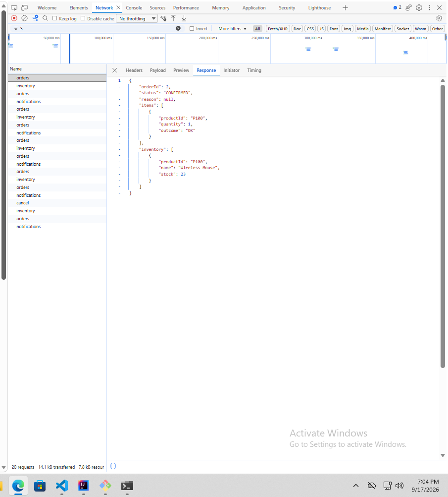
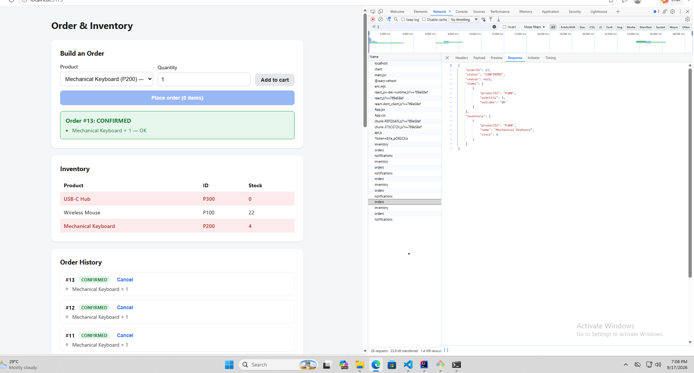
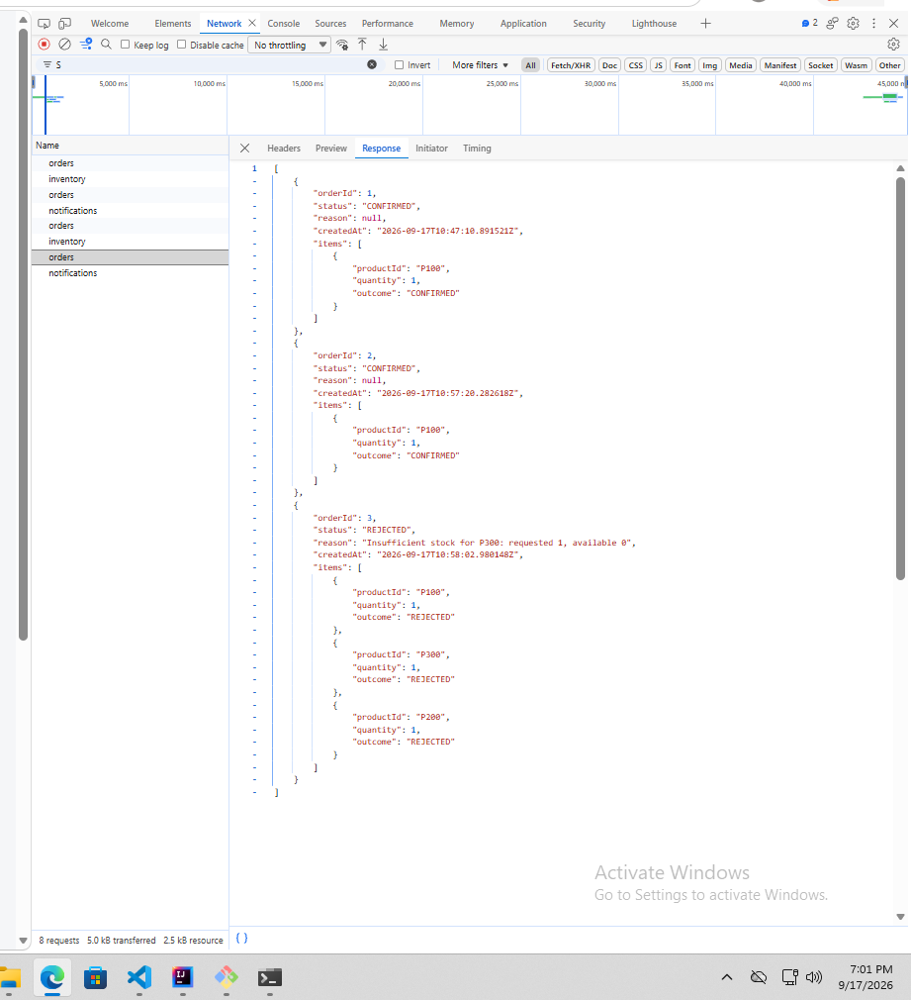
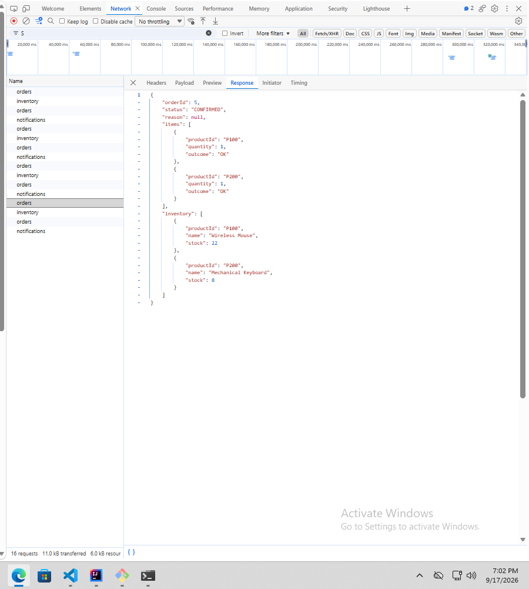
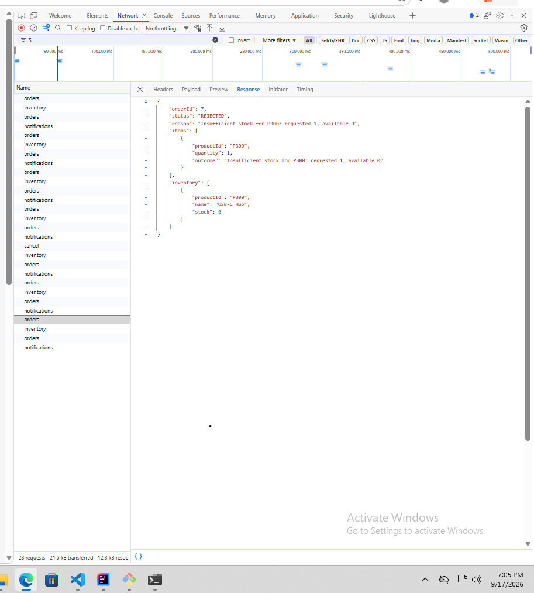
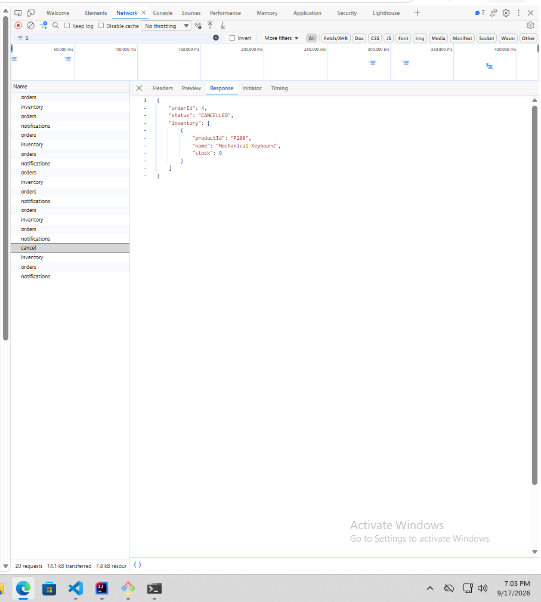

# Order & Inventory Integration

Single Spring Boot app with two in-process modules (`edu.cit.sibi.shop` for
Order, `edu.cit.sibi.inventory` for Inventory) sharing one Supabase
(Postgres) database, plus a React (Vite) frontend that talks to it over
REST.

```
order-inventory-integration/
├── backend/    Spring Boot app (Java 17, Maven)
├── frontend/   React + Vite app
├── sql/        schema.sql - table creation + seed data
└── docs/       put your Network tab screenshots here
```

## 1. Supabase setup

1. Create a free project at [supabase.com](https://supabase.com).
2. Open **SQL Editor → New query**, paste the contents of
   [`sql/schema.sql`](sql/schema.sql), and run it. This creates `inventory`
   and `orders` and seeds the three products (`P100` Wireless Mouse: 25,
   `P200` Mechanical Keyboard: 10, `P300` USB-C Hub: 0).
3. Go to **Project Settings → Database → Connection string → JDBC** and copy
   the connection URL, e.g.
   `jdbc:postgresql://db.<project-ref>.supabase.co:5432/postgres`.
4. Note your database password (set when the project was created, or reset
   it from the same page).

## 2. Backend — environment variables

Never commit real credentials. `backend/.env.example` documents what's
needed; set these as actual environment variables in your shell/IDE run
config before starting the app:

```
SUPABASE_DB_URL=jdbc:postgresql://db.<project-ref>.supabase.co:5432/postgres
SUPABASE_DB_USERNAME=postgres
SUPABASE_DB_PASSWORD=<your-database-password>
SERVER_PORT=8080
CORS_ALLOWED_ORIGIN=http://localhost:5173
```

Run it:

```bash
cd backend
export SUPABASE_DB_URL=...      # or set via your IDE's run configuration
export SUPABASE_DB_USERNAME=...
export SUPABASE_DB_PASSWORD=...
./mvnw spring-boot:run
```

The API comes up on `http://localhost:8080`.

## 3. Frontend

```bash
cd frontend
cp .env.example .env   # defaults to http://localhost:8080/api, edit if needed
npm install
npm run dev
```

Opens on `http://localhost:5173`, matching the backend's default CORS
allow-list.

## 4. API

`POST /api/orders`

```jsonc
{ "productId": "P100", "quantity": 2 }

{
  "status": "CONFIRMED",
  "reason": null,
  "inventory": { "productId": "P100", "name": "Wireless Mouse", "stock": 23 }
}
```

Also included: `GET /api/inventory` and `GET /api/inventory/{productId}`,
small read-only additions (not required by the spec) that let the frontend
dropdown show live stock instead of hardcoded numbers.

## 5. Network tab evidence


mvn spring-boot:run


- **Confirmed order:** request a quantity within stock (e.g. 2× P100).
  Screenshot the DevTools Network tab showing the `POST /api/orders`
  request/response with `"status": "CONFIRMED"`.
  → `docs/network-confirmed.png`
- **Rejected order:** request a quantity above stock (e.g. 5× P300, which is
  seeded at 0). Screenshot the same request/response showing
  `"status": "REJECTED"` and the `reason`.
  → `docs/network-rejected.png`

## 6. Reflection (300–500 words)

**1. In-process vs. microservices.** Calling `InventoryService.reserve(...)`
from `OrderService` here is a plain Java method call inside one JVM: it's
synchronous, type-checked at compile time, and either the whole request
succeeds or a Java exception unwinds the stack — Spring's `@Transactional`
even lets both the inventory update and the order insert commit or roll
back together as one database transaction, since they share a single
connection/transaction manager. I get all of that "for free" because
there's no process boundary. If Inventory were split into its own
microservice, I'd have to add back: network transport (REST/gRPC) and
serialization for every call; a strategy for partial failure (the network
request can time out or fail independently of whether the reservation
actually happened on the other side); no more shared ACID transaction, so
I'd need an alternative like the outbox pattern, sagas, or idempotency keys
to keep the order and the stock reservation consistent; retries with
backoff; service discovery/config for the Inventory URL; and probably
authentication between services. In short, the network buys deployability
and independent scaling, but every guarantee the JVM gave me implicitly
now has to be engineered explicitly.

**2. Why `InventoryServiceImpl` is package-private.** Making it
package-private means the compiler enforces the module boundary, not just
convention. `OrderService`'s constructor can only be written against the
`InventoryService` interface — there is no import that would let it
reference `InventoryServiceImpl`, cast to it, or call a method that isn't
declared on the interface. If it were `public`, nothing would stop Order
code from injecting the concrete class, calling implementation-specific
methods I never intended to expose, or coupling itself to persistence
details of Inventory (e.g. its use of `InventoryRepository`). That
coupling would be invisible until the day I tried to change
`InventoryServiceImpl`'s internals and something outside the package broke.
Package-private turns "please only use the interface" from a code-review
convention into a compiler-enforced rule.

**3. When to extract Inventory into its own service.** I'd consider it once
Inventory needs to scale, deploy, or fail independently of Order — e.g. it
gets hit by other systems too (a warehouse app, a supplier feed), needs a
different release cadence, or its read load is high enough to need its own
caching/read replicas. To do it, I'd keep the `InventoryService` interface
as the seam: replace `InventoryServiceImpl` with an HTTP/gRPC client
implementing the same interface, move the `inventory` table and its
repository into the new service, replace the shared `@Transactional` with a
saga/outbox to keep order and stock eventually consistent, and add
resilience (timeouts, retries, circuit breaking) around the new network
call. Because `OrderService` only ever depended on the interface, none of
its code would need to change — only the wiring.


# Order & Inventory Integration — Lab 2: Extending the Modular Monolith

Builds on Lab 1's Order/Inventory modular monolith (Spring Boot, one deployable,
shared Supabase/Postgres database). Lab 2 adds: multi-item orders with
all-or-nothing rollback, order cancellation with restock, read endpoints for
a live dashboard, and a third module — Notification — that reacts to Order
and Inventory activity purely through in-process domain events, never a
direct method call.

```
order-inventory-integration/
├── backend/    Spring Boot app (Java 17, Maven)
│   └── src/main/java/edu/cit/sibi/
│       ├── shop/          Order module (edu.cit.sibi.shop)
│       ├── inventory/     Inventory module (edu.cit.sibi.inventory)
│       └── notification/  Notification module (edu.cit.sibi.notification) — new in Lab 2
├── frontend/   React + Vite app
├── sql/        schema.sql — full rebuild: inventory, orders, order_items, notifications
└── docs/       Network tab evidence screenshots
```

## 1. Supabase setup

1. Create a free project at [supabase.com](https://supabase.com) (skip if you
   already have the Lab 1 project — this schema rebuilds on top of it).
2. Open **SQL Editor → New query**, paste the contents of
   [`sql/schema.sql`](sql/schema.sql), and run it. **This drops and recreates
   `inventory`, `orders`, and adds `order_items` and `notifications` from
   scratch** — the `orders` table's shape changed (no more single
   `product_id`/`quantity` columns; those moved into `order_items` to support
   multiple line items per order), so any orders from Lab 1 testing are gone
   after this runs. Inventory is reseeded to the original three products.
3. Grab your JDBC connection string from **Project Settings → Database →
   Connection string**. If your network doesn't support IPv6, use the
   **Session pooler** string instead of the direct connection — see the note
   at the bottom of this section.

## 2. Backend — environment variables

Same three as Lab 1, unchanged:

```
SUPABASE_DB_URL=jdbc:postgresql://<host>:5432/postgres
SUPABASE_DB_USERNAME=postgres   (or postgres.<project-ref> if using the pooler)
SUPABASE_DB_PASSWORD=<your-database-password>
```

Run it the same way as before (IntelliJ run configuration, or
`./mvnw spring-boot:run` from `backend/` with the vars exported).

## 3. Frontend

```bash
cd frontend
npm install
npm run dev
```

Opens on `http://localhost:5173`.

## 4. New API surface

| Endpoint | Purpose |
|---|---|
| `POST /api/orders` | Place a multi-item order: `{ items: [{ productId, quantity }, ...] }` → `{ orderId, status, reason, items: [{ productId, quantity, outcome }], inventory }` |
| `GET /api/orders` | Order history: every order with its status, reason, and line items |
| `POST /api/orders/{orderId}/cancel` | Cancel a CONFIRMED order and restock every line item; 404 if the order doesn't exist, 409 if already cancelled |
| `GET /api/inventory` | Live stock for every product (unchanged from Lab 1) |
| `GET /api/notifications` | Activity feed: order confirmations, rejections, and low-stock alerts, newest first |

### Multi-item, all-or-nothing

`OrderService.placeOrder` validates every line item against current stock
**before** reserving anything (`InventoryService.checkAvailability`, a
read-only sibling of `reserve`). If any single item would fail, the whole
order is saved as `REJECTED` and nothing is decremented — each item's
`outcome` in the response shows either `"OK"` (it would have succeeded) or
its specific failure reason, so you can see exactly which item sank the
order. Only when every item passes does the app loop back through and
actually call `reserve()` for each one, inside the same `@Transactional`
method that saves the order — so a database-level failure partway through
the reserve loop rolls back both the stock changes and the order row
together.

### Low-stock alerts

After any successful `reserve()`, if that product's remaining stock drops
below 5 (`OrderService.LOW_STOCK_THRESHOLD`), a `LowStockEvent` is published
alongside the order's own event. The frontend's inventory table highlights
any row below that threshold in red.

### Notification module boundary

`OrderService` publishes `OrderPlacedEvent` / `OrderRejectedEvent` /
`LowStockEvent` via Spring's `ApplicationEventPublisher`. It has no import
from `edu.cit.sibi.notification` anywhere in its code. `NotificationEventListener`
listens with plain `@EventListener` (not `@Async` — see the reflection below
for why) and is the only thing in the Notification module that imports
anything from Order or Inventory, and even then only the three event
record types in `edu.cit.sibi.shop.event`. Order and Inventory never import
anything from `notification`.

## 5. Network tab evidence








- **Multi-item order, all CONFIRMED:** add 2+ products to the cart, all
  within stock, submit. Screenshot the `POST /api/orders` request/response
  showing `"status": "CONFIRMED"` and every item's `outcome: "OK"`.
  → `docs/network-multi-confirmed.png`
- **Multi-item order, one item over stock → whole order REJECTED:** add one
  product within stock and one over stock (e.g. USB-C Hub, seeded at 0).
  Screenshot the response showing `"status": "REJECTED"`, the failing item's
  specific reason, and the other item still showing `"OK"` (proving it was
  validated but never reserved).
  → `docs/network-multi-rejected.png`
- **Cancel with restock reflected in inventory:** cancel a CONFIRMED order,
  then screenshot a follow-up `GET /api/inventory` call showing the stock
  back at its pre-order level.
  → `docs/network-cancel-restock.png`
- **Notification feed:** screenshot `GET /api/notifications` (or the
  Activity Feed panel in the UI) showing at least one confirmed-order entry,
  one rejected-order entry, and one low-stock alert entry.
  → `docs/network-notifications.png`

## 6. Reflection (300–500 words)

**1. Atomicity, in-process vs. split.** `placeOrder` validates every line
item with the read-only `checkAvailability` before touching any stock, so
the common failure mode (one item over stock) never causes a partial
reservation. The reserve loop and the order/order-items insert then run
inside one `@Transactional` method, sharing a single database transaction:
if anything throws partway through, Spring rolls back both the stock
decrements and the order row together, for free, on one JDBC connection.
Split across a network, that shared transaction disappears — each
`reserve()` becomes its own remote transaction committing independently. To
keep all-or-nothing semantics I'd need a saga: reserve each item one at a
time, track which succeeded, and if a later item fails, issue compensating
"restock" calls to undo the earlier successes rather than relying on a
database rollback. That needs idempotency keys (so a retried compensation
doesn't double-restock) and accepts a brief window where a customer could
see a "confirmed" item before compensation finishes undoing it.

**2. Events vs. direct calls.** Publishing `OrderPlacedEvent` instead of
calling `NotificationService.notify(...)` gives `OrderService` zero
compile-time dependency on Notification — it doesn't import its package,
doesn't know how many listeners exist, and publishing with zero listeners
is a silent no-op rather than an error. That's looser than even the
InventoryService interface gives Order/Inventory. Because everything is one
JVM, `@EventListener` delivery is synchronous and guaranteed — `@Async`
would gain non-blocking dispatch but lose the guarantee that the
notification write happens if the app crashes right after publishing; I
kept it synchronous since these writes are cheap and correctness (the
dashboard reflecting what actually happened) matters more than shaving
milliseconds. If Notification became its own microservice, in-process
pub/sub stops working — I'd need a real message broker (Kafka/RabbitMQ/SQS),
explicit event serialization, and a delivery guarantee decision
(at-least-once means Notification must dedupe by order ID), plus an outbox
pattern so a message isn't lost between committing the order and publishing
it.

**3. Which module to extract first.** Notification, easily. Nothing depends
on it — Order and Inventory never import its package — and it already
communicates through events rather than direct calls, so the seam is
already drawn. Its own table has no foreign keys pointing into it, and a
missed or delayed notification doesn't corrupt an order or inventory count
the way a failed reservation would. Inventory, by contrast, sits in the
critical path of every order with real referential integrity to `orders`;
extracting it first would immediately force the saga/compensating-transaction
complexity from question 1 onto the whole app. To extract Notification: swap
the in-process `ApplicationEventPublisher` publish for a message-broker
producer (or an outbox table plus a small poller) on the Order side, replace
`@EventListener` with a queue consumer on the Notification side, move the
`notifications` table into Notification's own database, and add retry/
dead-letter handling since delivery can now fail independently of whether
the order itself succeeded.
