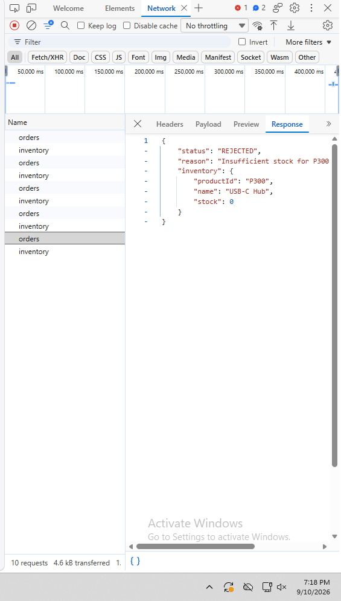
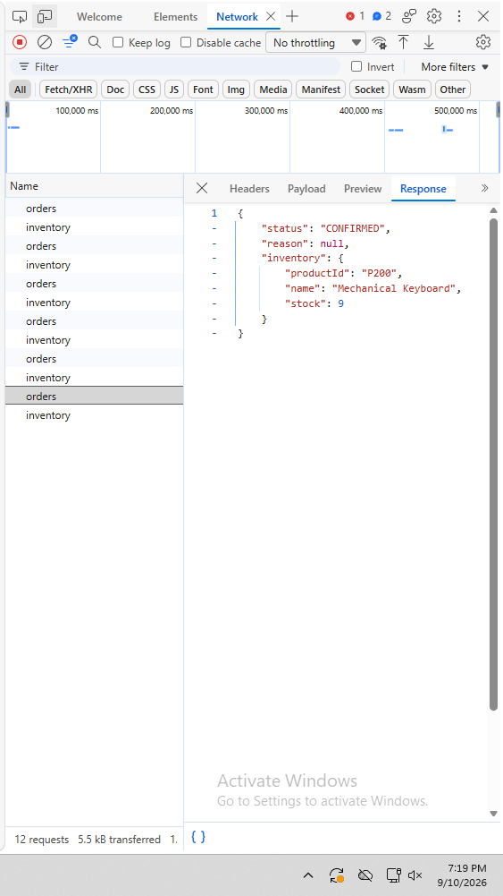
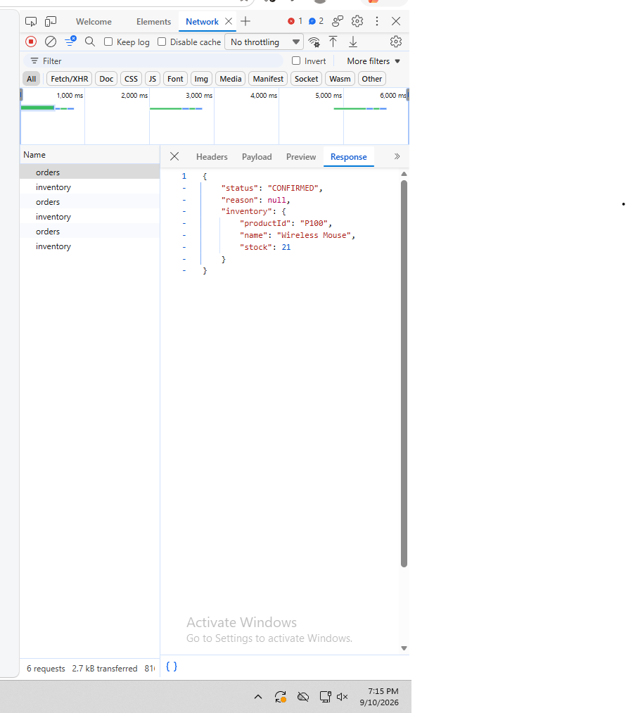

# Order & Inventory Integration

Single Spring Boot app with two in-process modules (`edu.cit.sibi.shop` for
Order, `edu.cit.sibi.inventory` for Inventory) sharing one Supabase
(Postgres) database, plus a React (Vite) frontend that talks to it over
REST.

```
order-inventory-integration/
├── backend/    Spring Boot app (Java 17, Maven)
├── frontend/   React + Vite app
├── sql/        schema.sql - table creation + seed data
└── docs/       put your Network tab screenshots here
```

## 1. Supabase setup

1. Create a free project at [supabase.com](https://supabase.com).
2. Open **SQL Editor → New query**, paste the contents of
   [`sql/schema.sql`](sql/schema.sql), and run it. This creates `inventory`
   and `orders` and seeds the three products (`P100` Wireless Mouse: 25,
   `P200` Mechanical Keyboard: 10, `P300` USB-C Hub: 0).
3. Go to **Project Settings → Database → Connection string → JDBC** and copy
   the connection URL, e.g.
   `jdbc:postgresql://db.<project-ref>.supabase.co:5432/postgres`.
4. Note your database password (set when the project was created, or reset
   it from the same page).

## 2. Backend — environment variables

Never commit real credentials. `backend/.env.example` documents what's
needed; set these as actual environment variables in your shell/IDE run
config before starting the app:

```
SUPABASE_DB_URL=jdbc:postgresql://db.<project-ref>.supabase.co:5432/postgres
SUPABASE_DB_USERNAME=postgres
SUPABASE_DB_PASSWORD=<your-database-password>
SERVER_PORT=8080
CORS_ALLOWED_ORIGIN=http://localhost:5173
```

Run it:

```bash
cd backend
export SUPABASE_DB_URL=...      # or set via your IDE's run configuration
export SUPABASE_DB_USERNAME=...
export SUPABASE_DB_PASSWORD=...
./mvnw spring-boot:run
```

The API comes up on `http://localhost:8080`.

## 3. Frontend

```bash
cd frontend
cp .env.example .env   # defaults to http://localhost:8080/api, edit if needed
npm install
npm run dev
```

Opens on `http://localhost:5173`, matching the backend's default CORS
allow-list.

## 4. API

`POST /api/orders`

```jsonc
{ "productId": "P100", "quantity": 2 }

{
  "status": "CONFIRMED",
  "reason": null,
  "inventory": { "productId": "P100", "name": "Wireless Mouse", "stock": 23 }
}
```

Also included: `GET /api/inventory` and `GET /api/inventory/{productId}`,
small read-only additions (not required by the spec) that let the frontend
dropdown show live stock instead of hardcoded numbers.

## 5. Network tab evidence




- **Confirmed order:** request a quantity within stock (e.g. 2× P100).
  Screenshot the DevTools Network tab showing the `POST /api/orders`
  request/response with `"status": "CONFIRMED"`.
  → `docs/network-confirmed.png`
- **Rejected order:** request a quantity above stock (e.g. 5× P300, which is
  seeded at 0). Screenshot the same request/response showing
  `"status": "REJECTED"` and the `reason`.
  → `docs/network-rejected.png`

## 6. Reflection (300–500 words)

**1. In-process vs. microservices.** Calling `InventoryService.reserve(...)`
from `OrderService` here is a plain Java method call inside one JVM: it's
synchronous, type-checked at compile time, and either the whole request
succeeds or a Java exception unwinds the stack — Spring's `@Transactional`
even lets both the inventory update and the order insert commit or roll
back together as one database transaction, since they share a single
connection/transaction manager. I get all of that "for free" because
there's no process boundary. If Inventory were split into its own
microservice, I'd have to add back: network transport (REST/gRPC) and
serialization for every call; a strategy for partial failure (the network
request can time out or fail independently of whether the reservation
actually happened on the other side); no more shared ACID transaction, so
I'd need an alternative like the outbox pattern, sagas, or idempotency keys
to keep the order and the stock reservation consistent; retries with
backoff; service discovery/config for the Inventory URL; and probably
authentication between services. In short, the network buys deployability
and independent scaling, but every guarantee the JVM gave me implicitly
now has to be engineered explicitly.

**2. Why `InventoryServiceImpl` is package-private.** Making it
package-private means the compiler enforces the module boundary, not just
convention. `OrderService`'s constructor can only be written against the
`InventoryService` interface — there is no import that would let it
reference `InventoryServiceImpl`, cast to it, or call a method that isn't
declared on the interface. If it were `public`, nothing would stop Order
code from injecting the concrete class, calling implementation-specific
methods I never intended to expose, or coupling itself to persistence
details of Inventory (e.g. its use of `InventoryRepository`). That
coupling would be invisible until the day I tried to change
`InventoryServiceImpl`'s internals and something outside the package broke.
Package-private turns "please only use the interface" from a code-review
convention into a compiler-enforced rule.

**3. When to extract Inventory into its own service.** I'd consider it once
Inventory needs to scale, deploy, or fail independently of Order — e.g. it
gets hit by other systems too (a warehouse app, a supplier feed), needs a
different release cadence, or its read load is high enough to need its own
caching/read replicas. To do it, I'd keep the `InventoryService` interface
as the seam: replace `InventoryServiceImpl` with an HTTP/gRPC client
implementing the same interface, move the `inventory` table and its
repository into the new service, replace the shared `@Transactional` with a
saga/outbox to keep order and stock eventually consistent, and add
resilience (timeouts, retries, circuit breaking) around the new network
call. Because `OrderService` only ever depended on the interface, none of
its code would need to change — only the wiring.
